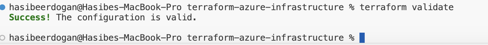

# Terraform Azure Infrastructure

Infrastructure as Code (IaC) project built with Terraform and Microsoft Azure.

This project demonstrates how cloud infrastructure can be defined, validated, and managed using Terraform. The infrastructure includes Azure networking resources, storage services, and an automated GitHub Actions validation pipeline.

---

## Features

- Infrastructure as Code with Terraform
- Azure Resource Group configuration
- Azure Virtual Network (VNet)
- Azure Subnet configuration
- Azure Storage Account
- GitHub Actions CI pipeline
- Terraform validation and formatting checks
- AzureRM provider integration

---

## Tech Stack

- Terraform
- Microsoft Azure
- AzureRM Provider
- GitHub Actions

---

## Project Structure

```text
terraform-azure-infrastructure/
│
├── .github/
│   └── workflows/
│       └── terraform-ci.yml
│
├── main.tf
├── provider.tf
├── variables.tf
├── outputs.tf
├── .terraform.lock.hcl
└── README.md
```

---

## Infrastructure Architecture

```text
Resource Group
│
├── Virtual Network
│
├── Subnet
│
└── Storage Account
```

---

## Resources Defined

### Azure Resource Group

Creates a dedicated resource group for organizing cloud resources.

### Azure Virtual Network

Creates a virtual network for cloud networking.

### Azure Subnet

Creates a subnet within the virtual network.

### Azure Storage Account

Creates a storage account for Azure storage services.

---

## Terraform Commands

### Initialize Terraform

```bash
terraform init
```

### Validate Configuration

```bash
terraform validate
```

### Format Terraform Files

```bash
terraform fmt
```

### Generate Execution Plan

```bash
terraform plan
```

### Deploy Infrastructure

```bash
terraform apply
```

---

## CI/CD Pipeline

GitHub Actions automatically executes:

```text
Terraform Format Check
↓
Terraform Init
↓
Terraform Validate
```

on every push to the main branch.

---

## GitHub Actions

The project includes an automated CI workflow that validates Terraform code quality and configuration correctness.

Workflow file:

```text
.github/workflows/terraform-ci.yml
```

Pipeline stages:

- Terraform Format Check
- Terraform Init
- Terraform Validate

---

## Screenshots

### Terraform Validation



### Terraform Plan


### GitHub Actions Success


---


## Learning Outcomes

Through this project:

- Learned Infrastructure as Code (IaC) concepts
- Built Azure infrastructure using Terraform
- Worked with Azure Resource Manager (AzureRM)
- Implemented GitHub Actions CI validation pipelines
- Generated and reviewed Terraform execution plans
- Gained experience with Azure authentication and RBAC permissions

---

## Future Improvements

- Azure App Service deployment
- Azure Kubernetes Service (AKS)
- Remote Terraform State
- Azure Key Vault integration
- Terraform Modules
- Multi-environment deployments (Dev / Test / Prod)
- Automated Terraform Plan and Apply using Azure credentials

---

## Author

**Hasibe Erdogan**

